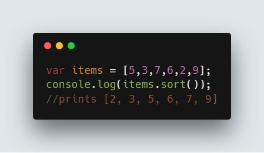
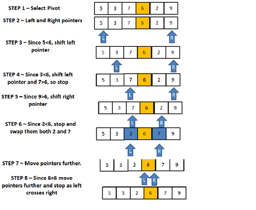
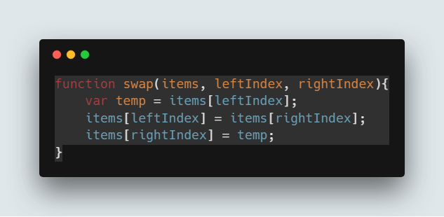
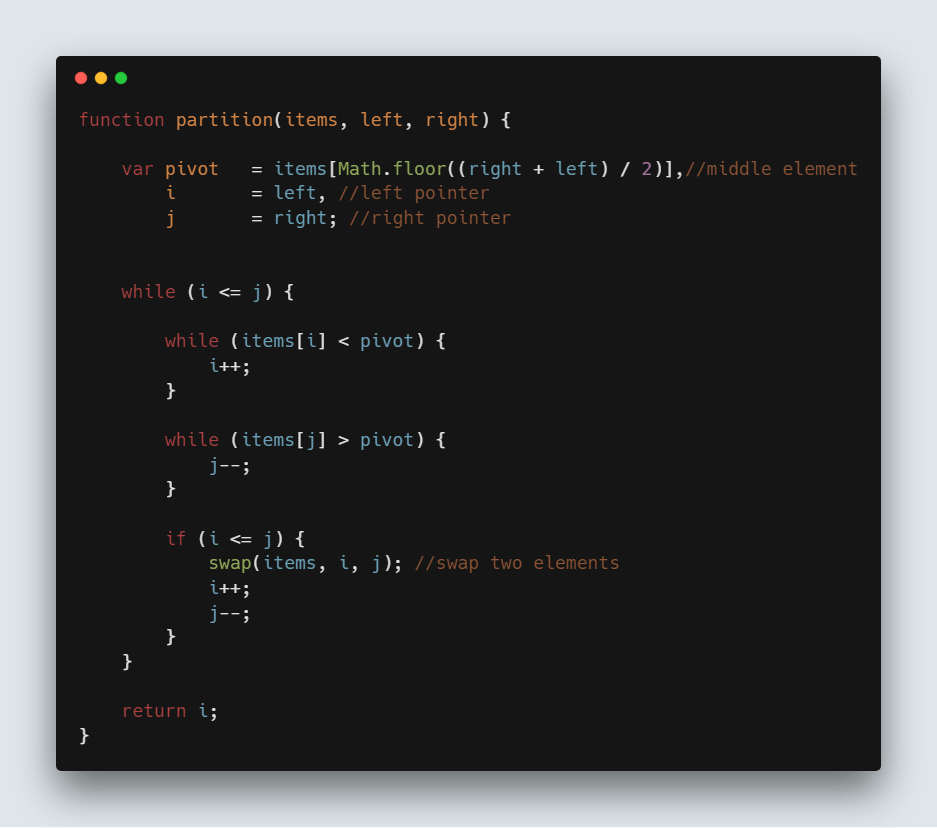
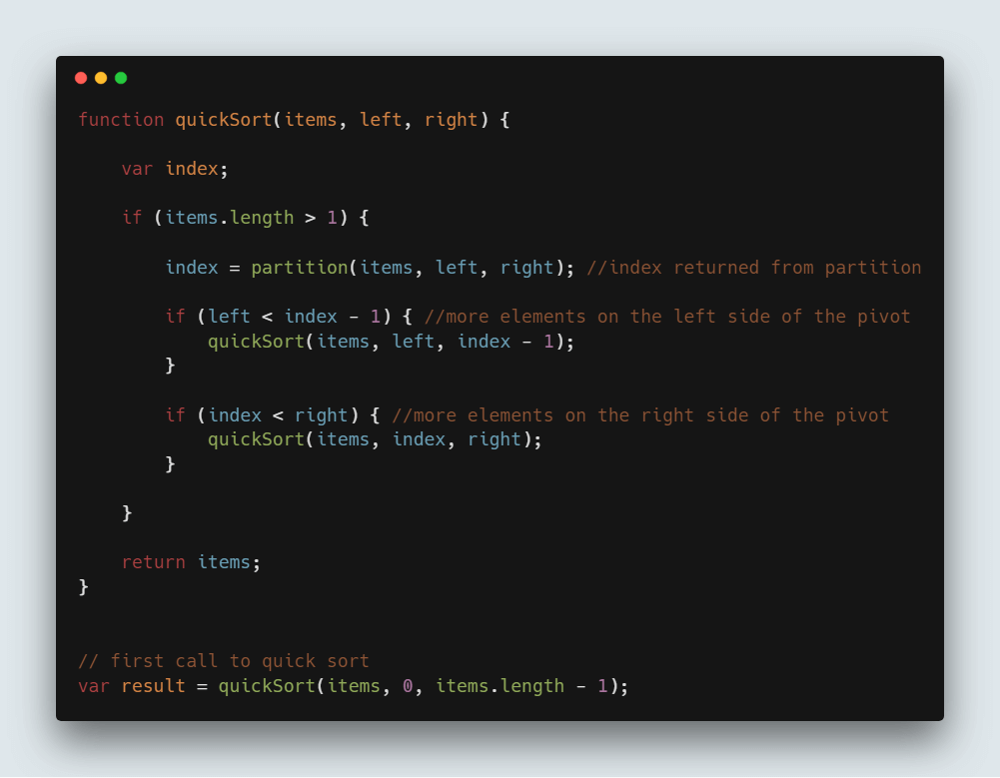
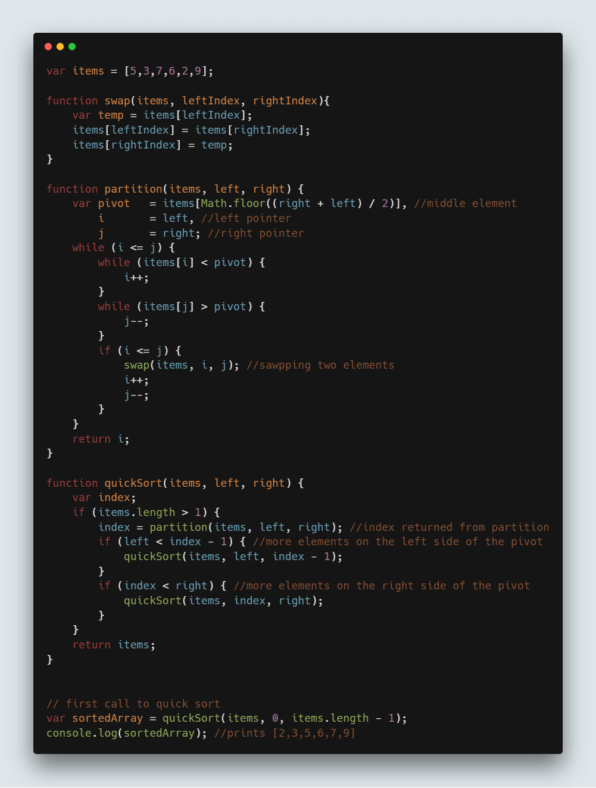

# QuickSort Algorithm in JavaScript

https://www.guru99.com/quicksort-in-javascript.html

## What is Quick Sort?

**Quick Sort** algorithm follows Divide and Conquer approach. It divides elements into smaller parts based on some condition and performing the sort operations on those divided smaller parts.

Quick Sort algorithm is one of the most used and popular algorithms in any programming language. But, if you are a JavaScript developer, then you might of heard of **sort()** which is already available in JavaScript. Then, you might have been thinking what the need of this Quick Sort algorithm is. To understand this, first we need what is sorting and what is the default sorting in JavaScript.

## What is Sorting?

Sorting is nothing but, arranging elements in the order we want. You might have come across this in your school or college days. Like arranging numbers from smaller to greater (ascending) or from greater to smaller (descending) is what we saw till now and is called sorting.

## Default sorting in JavaScript

As mentioned earlier, JavaScript has **sort()**. Let us take an example with few array of elements like [5,3,7,6,2,9] and want to sort this array elements in ascending order. Just call **sort()** on items array and it sorts array elements in ascending order.



**Code:**

```js
var items = [5,3,7,6,2,9];
console.log(items.sort());
//prints [2, 3, 5, 6, 7, 9]
```

**What is the reason to choose Quick sort over default sort() in JavaScript**

Though sort() gives the result we want, problem lies with the way it sorts the array elements. Default sort() in JavaScript uses **insertion sort** by **V8 Engine of Chrome** and **Merge sort** by **Mozilla Firefox** and **Safari**.

But, other this is not suitable if you need to sort large number of elements. So, the solution is to use Quick sort for large dataset.

So, to understand completely, you need to know how Quick sort works and let us see that in detail now.

## What is Quick sort?

Quick sort follows **Divide and Conquer** algorithm. It is dividing elements in to smaller parts based on some condition and performing the sort operations on those divided smaller parts. Hence, it works well for large datasets. So, here are the steps how Quick sort works in simple words.

1. First select an element which is to be called as **pivot** element.
2. Next, compare all array elements with the selected pivot element and arrange them in such a way that, elements less than the pivot element are to it’s left and greater than pivot is to it’s right.
3. Finally, perform the same operations on left and right side elements to the pivot element.

So, that is the basic outline of Quick sort. Here are the steps which need to be followed one by one to perform Quick sort.

## How does QuickSort Work

1. First find the **“pivot”** element in the array.
2. Start the left pointer at first element of the array.
3. Start the right pointer at last element of the array.
4. Compare the element pointing with left pointer and if it is less than the pivot element, then move the left pointer to the right (add 1 to the left index). Continue this until left side element is greater than or equal to the pivot element.
5. Compare the element pointing with right pointer and if it is greater than the pivot element, then move the right pointer to the left (subtract 1 to the right index). Continue this until right side element is less than or equal to the pivot element.
6. Check if left pointer is less than or equal to right pointer, then swap the elements in locations of these pointers.
7. Increment the left pointer and decrement the right pointer.
8. If index of left pointer is still less than the index of the right pointer, then repeat the process; else return the index of the left pointer.



So, let us see these steps with an example. Let us consider array of elements which we need to sort is [5,3,7,6,2,9].

## Determine Pivot element

But before going forward with the Quick sort, selecting the pivot element plays a major role. If you select the first element as the pivot element, then it gives worst performance in the sorted array. So, it is always advisable to pick the middle element (length of the array divided by 2) as the pivot element and we do the same.

Here are the steps to perform Quick sort that is being shown with an example [5,3,7,6,2,9].

**STEP 1:** Determine pivot as middle element. So, **7** is the pivot element.

**STEP 2:** Start left and right pointers as first and last elements of the array respectively. So, left pointer is pointing to **5** at index 0 and right pointer is pointing to **9** at index 5.

**STEP 3:** Compare element at the left pointer with the pivot element. Since, 5 < 6 shift left pointer to the right to index 1.

**STEP 4:** Now, still 3 <6 so shift left pointer to one more index to the right. So now 7 > 6 stop incrementing the left pointer and now left pointer is at index 2.

**STEP 5:** Now, compare value at the right pointer with the pivot element. Since 9 > 6 move the right pointer to the left. Now as 2 < 6 stop moving the right pointer.

**STEP 6:** Swap both values present at left and right pointers with each other.

**STEP 7:** Move both pointers one more step.

**STEP 8:** Since 6 = 6, move pointers to one more step and stop as left pointer crosses the right pointer and return the index of the left pointer.

So, here based on the above approach, we need to write code for swapping elements and partitioning the array as mentioned in above steps.

## Code to swap two numbers in JavaScript:



```js
function swap(items, leftIndex, rightIndex){
    var temp = items[leftIndex];
    items[leftIndex] = items[rightIndex];
    items[rightIndex] = temp;
}
```

## Code to perform the partition as mentioned in above steps:



```js
function partition(items, left, right) {
    var pivot   = items[Math.floor((right + left) / 2)], //middle element
        i       = left, //left pointer
        j       = right; //right pointer
    while (i <= j) {
        while (items[i] < pivot) {
            i++;
        }
        while (items[j] > pivot) {
            j--;
        }
        if (i <= j) {
            swap(items, i, j); //swap two elements
            i++;
            j--;
        }
    }
    return i;
}
```

## Perform the recursive operation

Once you perform above steps, index of the left pointer will be returned and we need to use that to divide the array and perform the Quick sort on that part. Hence, it is called Divide and Conquer algorithm.

So, Quick sort is performed until all elements on the left array and right array are sorted.

**Note:** Quick sort is performed on the same array and no new arrays are created in the process.

So, we need to call this **partition()** explained above and based on that we divide the array in to parts. So here is the code where you use it,



```js
function quickSort(items, left, right) {
    var index;
    if (items.length > 1) {
        index = partition(items, left, right); //index returned from partition
        if (left < index - 1) { //more elements on the left side of the pivot
            quickSort(items, left, index - 1);
        }
        if (index < right) { //more elements on the right side of the pivot
            quickSort(items, index, right);
        }
    }
    return items;
}
// first call to quick sort
var result = quickSort(items, 0, items.length - 1);
```

## Complete Quick sort code:

```js
var items = [5,3,7,6,2,9];
function swap(items, leftIndex, rightIndex){
    var temp = items[leftIndex];
    items[leftIndex] = items[rightIndex];
    items[rightIndex] = temp;
}
function partition(items, left, right) {
    var pivot   = items[Math.floor((right + left) / 2)], //middle element
        i       = left, //left pointer
        j       = right; //right pointer
    while (i <= j) {
        while (items[i] < pivot) {
            i++;
        }
        while (items[j] > pivot) {
            j--;
        }
        if (i <= j) {
            swap(items, i, j); //sawpping two elements
            i++;
            j--;
        }
    }
    return i;
}

function quickSort(items, left, right) {
    var index;
    if (items.length > 1) {
        index = partition(items, left, right); //index returned from partition
        if (left < index - 1) { //more elements on the left side of the pivot
            quickSort(items, left, index - 1);
        }
        if (index < right) { //more elements on the right side of the pivot
            quickSort(items, index, right);
        }
    }
    return items;
}
// first call to quick sort
var sortedArray = quickSort(items, 0, items.length - 1);
console.log(sortedArray); //prints [2,3,5,6,7,9]
```




**NOTE:** Quick sort runs with the Time Complexity of **O(nlogn).**
