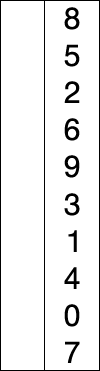

# Алгоритмы

Алгоритмы – это основа программирования, определяющая, каким образом программное обеспечение будет использовать структуры данных

#### Список книг


1. [Грокаем алгоритмы 2017](https://t.me/c/1359746566/6)
1. Алгоритмы для начинающих: Теория и практика для разработчика - Панос Луридас
2. [Совершенный алгоритм. Основы](https://t.me/c/1359746566/8)
3. [Совершенный алгоритм. Графовые алгоритмы и структуры данных](https://t.me/c/1359746566/9)
4. [Совершенный алгоритм. Жадные алгоритмы и динамическое программирование](https://t.me/c/1359746566/10)
5. [Совершенный алгоритм. Алгоритмы для NP трудных задач](https://t.me/c/1359746566/11)
6. [Алгоритмы разработка и применение. Классика Computers Science](https://t.me/c/1359746566/12)

Кормен, Вирт, Макконел, Кнут


### Алгоритмы поиска

- [Линейный поиск](#LinearSearch)
- [Двоичный поиск](#BinarySearch)
- [Интерполирующий поиск](#InterpolatingSearch)
- [Поиск подстроки](#SubstringSearch)

### Алгоритмы сортировки

https://proglib.io/p/sort-gif

- [Быстрая сортировка (quick)](#QuickSort)
- [Сортировка выбором (selection)](#SelectionSort)
- [Сортировка слиянием (merge)](#MergeSort)
- [Сортировка пузырьком (bubble)](#BubbleSort)
- [Сортировка вставками (inserting)](#InsertingSort)
- [Блочная сортировка](#block)


------

### Поиск

#### Линейный поиск <a name="LinearSearch"></a> 

Это стандартное решение для перебора, я уверен, вы уже делали это тысячу раз. Мы просто говорим: «Мне нужно что-то, так что просматривайте все один за другим, пока не найдете это». Если элементов в миллион раз больше, это займет в миллион раз больше времени, и это может привести к долгому выполнению или даже зависанию браузера.

```js
function linearSearch(arr, key){
    for(let i = 0; i < arr.length; i++){
        if(arr[i] === key){
            return i
        }
    }
    return -1
}

// поиск всех вхождений
function globalLinearSearch(arr, key){
    let results = []
    for(let i = 0; i < arr.length; i++){
        if(arr[i] === key){
            results.push(i)
        }
    }
    // If results array is empty, return -1
    if(!results){
        return -1
    }

    return results
}
```


#### Двоичный поиск <a name="BinarySearch"></a> 

**Цикл**

```js
const arr = [...Array(100).keys()].map(i => i*100);

function binarySearch(finding, sortedArray){
    let start = 0;
    let end = sortedArray.length - 1;

    while (start <= end) {
        let middle = Math.floor((start + end) / 2);
        let guess = sortedArray[middle];

        if (guess === finding) {
            return middle;
        } else if (guess > finding) {
            end = middle - 1;
        } else {
            start = middle + 1;
        }
    }
    return null;
}

console.log(binarySearch(200, arr));
```

**Рекурсия**

```js
const arr = [...Array(100).keys()].map(i => i*100);

function binarySearch(finding, sortedArray, start = 0, end = sortedArray.length-1) {
    if (!sortedArray.length) {
        return null;
    }

    const middle = Math.floor((start + end) / 2);
    const guess = sortedArray[middle];

    if (guess > finding) {
        end = middle - 1;
    } else {
        start = middle + 1;
    }    

    if (guess === finding) {
        return middle; // or "guess"
    } else {
        return binarySearch(finding, sortedArray, start, end);
    }
}

console.log(binarySearch(200, arr));
```


#### Интерполирующий поиск <a name="InterpolatingSearch"></a> 
#### Поиск подстроки <a name="SubstringSearch"></a> 


------

### Сортировка

https://academy.yandex.ru/posts/osnovnye-vidy-sortirovok-i-primery-ikh-realizatsii

| **Алгоритм сортировки** | **Сложность времени** |                    |                   |
| ----------------------- | --------------------- | ------------------ | ----------------- |
|                         | **Лучший случай**     | **Средний случай** | **Худший случай** |
| Пузырьковая сортировка  | Ω (N)                 | Θ (N 2 )           | O (N 2 )          |
| Выбор сортировки        | Ω (N 2 )              | Θ (N 2 )           | O (N 2 )          |
| Сортировка вставки      | Ω (N)                 | Θ (N 2 )           | O (N 2 )          |
| Сортировка слиянием     | Ω (N log N)           | Θ (N log N)        | O (N log N)       |
| Куча сортировка         | Ω (N log N)           | Θ (N log N)        | O (N log N)       |
| Быстрая сортировка      | Ω (N log N)           | Θ (N log N)        | O (N 2 )          |

#### Быстрая сортировка (quick) <a name="QuickSort"></a> 


##### Фильтры

- **Медленнее индексов**
- Работает в Функциональном программировании
- Поддерживает дубликаты (не по умолчанию)
- Работает с любым опорным элементом
- Не изменяет исходный список

```js
function quickSort(list) {
    // const list = [...originalList]; // не нужно, но на всякий случай

    if (list.length < 2) {
        return list
    }

    const pivot = list[Math.floor(list.length / 2)];

    const pivotDublicate = list.filter((item) => item === pivot); // дубликаты опорного элемента
    const smaller = list.filter((item) => item < pivot);
    const bigger = list.filter((item) => item > pivot);

    const _smaller = quickSort(smaller);
    const _bigger = quickSort(bigger);

    // return [..._smaller, ...pivotDublicate, ..._bigger]; // дубликаты опорного элемента
    return [..._smaller, pivot, ..._bigger];
}

const list = [-1, -2, -3, 3, 2, 1, 3, 2, 1];

console.log(quickSort(list)); // [-3, -2, -1, 1, 2, 3]
// [-3, -2, -1, 1, 1, 2, 2, 3, 3] - дубликаты опорного элемента
```


##### Индексы

- **Быстрее фильтров**
- Через перемещение индексов
- По умолчанию поддерживает дубликаты
- Изменяет исходный список (массив)
- Не поддерживает случайный опорный элемент, только средний

```js
function partition(list, left, right) {
    const pivot = list[Math.floor((right + left) / 2)];
    let i = left;
    let j = right;
    while (i <= j) {
        while (list[i] < pivot) i++;
        while (list[j] > pivot) j--;
        if (i <= j) {
            [list[j], list[i]] = [list[i], list[j]]; //sawpping two elements
            i++;
            j--;
        }
    }
    return i;
}

function quickSort(list, left=0, right=list.length-1) {
    if (list.length > 1) {
        let index = partition(list, left, right);

        if (left < index - 1) {
            quickSort(list, left, index - 1);
        }
        if (index < right) {
            quickSort(list, index, right);
        }
    }
    return list;
}

const list = [-1, -2, -3, 3, 2, 1, 3, 2, 1];

console.log(quickSort(list)); // [-3, -2, -1, 1, 1, 2, 2, 3, 3]
```


##### Индексы рекурсия

```js
...
```

##### Цикл

```js
...
```


#### Сортировка выбором (selection) <a name="SelectionSort"></a> 

За каждый проход по массиву **выбрать** минимальный элемент (для сортировки по возрастанию) и поменять его местами с первым элементом в еще не отсортированном участке массива, тем самым уменьшив длину этого участка на один, и так до тех пор пока не будут отсортированы все элементы.



##### Рекурсия

```js
function selectionSort(arr, startIndex = 0) {
    let minIndex = startIndex;

    if (startIndex >= arr.length) {
        return arr;
    }
    
    for (let i = startIndex; i < arr.length; i++) {
        if (arr[minIndex] > arr[i]) {
            minIndex = i;
        }
    }
    
    [arr[startIndex], arr[minIndex]] = [arr[minIndex], arr[startIndex]];

    return selectionSort(arr, startIndex + 1);
}

const array = [9,8,7,11,6,15,0,5,-5,4,3,30,2,1];

console.log(selectionSort(array)); // [-5, 0, 1, 2, 3, 4, 5, 6, 7, 8, 9, 11, 15, 30]
```


##### Циклы

```js
function selectionSort(arr) {
  const array = [...arr];
  const arrayLength = array.length;
  for (let i = 0; i < arrayLength; i++) {
    let indexMin = i;
    for (let j = i; j < arrayLength; j++) {
      if (array[indexMin] > array[j]) {
        indexMin = j;
      }
    }
    if (indexMin !== i) {
      [array[indexMin], array[i]] = [array[i], array[indexMin]];
    }
  }
  return array;
}

const array = [9,8,7,11,6,15,0,5,-5,4,3,30,2,1];

console.log(selectionSort(array)); // [-5, 0, 1, 2, 3, 4, 5, 6, 7, 8, 9, 11, 15, 30]
```


#### Сортировка слиянием (merge) <a name="MergeSort"></a> 

Разбить неупорядоченный массив на N частей для упорядоченной обработки, а затем объединить.


```js
function merge(left, right) {
    let arr = [];
    
    while(left.length && right.length) {
        // if (left[0] < right[0]) {
        //     arr.push(left.shift());
        // } else {
        //     arr.push(right.shift());
        // }
        arr.push(left[0] < right[0] ? left.shift() : right.shift());
    }
    
    return [...arr, ...left, ...right];
}

function mergeSort(arr) {
    const middle = Math.round(arr.length / 2);

    if (arr.length < 2) {
        return arr;
    }

    // const left = arr.splice(0, middle);
    // const right = arr;

    const left = arr.slice(0, middle);
    const right = arr.slice(middle);

    return merge(mergeSort(left), mergeSort(right));
}

const array = [9,8,7,6,5,6,5,4,3,2,1,9,6];
console.log(mergeSort(array)); // [1, 2, 3, 4, 5, 5, 6, 6, 6, 7, 8, 9, 9]

```


#### Сортировка пузырьком (bubble) <a name="BubbleSort"></a>

Нужно последовательно сравнивать значения соседних элементов и менять числа местами, если предыдущее оказывается больше последующего. Таким образом элементы с большими значениями оказываются в конце списка, а с меньшими остаются в начале.


##### Циклы

```js
function bubbleSort(array) {
  for (let i = array.length; i > 0; i--) {
    for (let j = 0; j < i; j++) {
      if (array[j] > array[j + 1]) {
        [array[j], array[j + 1]] = [array[j + 1], array[j]];
      }
    }
  }
  return array;
}
const array = [9,8,7,6,5,6,5,4,3,2,1,9,6];
console.log(bubbleSort(array)); // [1, 2, 3, 4, 5, 5, 6, 6, 6, 7, 8, 9, 9]
```


##### Рекурсия

```js
function bubbleSort(array, length = array.length) {
  let swapped = false;

  for (let i = 0; i < length; i++) {
    if (array[i] > array[i + 1]) {
      [array[i], array[i + 1]] = [array[i + 1], array[i]];
      swapped = true;
    }
  }

  if (swapped) {
    array = bubbleSort(array, length - 1);
  }
  return array;
}

const array = [9,8,7,6,5,6,5,4,3,2,1,9,6];
console.log(bubbleSort(array)); // [1, 2, 3, 4, 5, 5, 6, 6, 6, 7, 8, 9, 9]
```


##### Цикл do...while

```js
function bubbleSort(arr) {
  let swapped;
  let array = [...arr];

  do {
    swapped = false;
    for (let i = 0; i < array.length; i++) {
      if (array[i] > array[i + 1]) {
        [array[i], array[i + 1]] = [array[i + 1], array[i]];
        swapped = true;
      }
    }
  } while (swapped);
    
  return array;
}

const array = [9,8,7,6,5,6,5,4,3,2,1,9,6];
console.log(bubbleSort(array)); // [1, 2, 3, 4, 5, 5, 6, 6, 6, 7, 8, 9, 9]
```


#### Сортировка перемешиванием (шейкерная) <a name="MixingSort"></a>

https://learn.coderslang.com/ru/0037-javascript-optimized-bubble-sort.-coctail-sort/

https://medium.com/@alivander/%D1%88%D0%B5%D0%B9%D0%BA%D0%B5%D1%80%D0%BD%D0%B0%D1%8F-%D1%81%D0%BE%D1%80%D1%82%D0%B8%D1%80%D0%BE%D0%B2%D0%BA%D0%B0-javascript-a2b8af562ee

Шейкерная *сортировка* (Cocktail sort), она же *сортировка перемешиванием*, она же двунаправленная *сортировка*


#### Сортировка вставками (inserting) <a name="InsertingSort"></a> 

В цикле один за другим выбираются элементы массива и сравниваются с элементами, стоящими перед ними, до тех пор пока не будет найдет элемент, меньший текущего, или мы не дойдем до начала массива. Перед ним мы и **вставляем** текущий, для этого предварительно сдвинув все элементы, которые оказались больше текущего, в сторону увеличения на один индекс.


```js
function insertingSort(arr) {
    let array = [...arr];
    for (let i = 1; i < array.length; i++) {
        const currentItem = array[i];
        for (let j = i; j > 0 && array[j - 1] > currentItem; j--) {
            [array[j], array[j - 1]] = [array[j - 1], array[j]];
        }
    }
    return array;
}
const array = [9,8,7,6,5,6,5,4,3,2,1,9,6];
console.log(insertingSort(array)); // [1, 2, 3, 4, 5, 5, 6, 6, 6, 7, 8, 9, 9]
```


#### Сортировка расчёсткой (comb) <a name="CombSort"></a>

https://medium.com/@alivander/%D1%81%D0%BE%D1%80%D1%82%D0%B8%D1%80%D0%BE%D0%B2%D0%BA%D0%B0-%D1%80%D0%B0%D1%81%D1%87%D0%B5%D1%81%D0%BA%D0%BE%D0%B9-javascript-19b587506803


#### Пирамидальная сортировка (кучей, Heap) <a name="HeapSort"></a>


#### Timsort

https://habr.com/ru/company/otus/blog/565640/

https://habr.com/ru/company/infopulse/blog/133303/

https://habr.com/ru/post/133996/

Алгоритм построен на той идее, что в реальном мире сортируемый массив данных часто содержат в себе упорядоченные (не важно, по возрастанию или по убыванию) подмассивы.

#### Shell sort

Усовершенствованный алгоритм сортировки вставками

#### Tree sort

------

## Рекурсия

Зачем применять рекурсию, если задача легко решается с циклом?В языках функционального программирования, таких как Haskell, циклов нет, поэтому для написания подобных функций приходится применять рекурсию.
